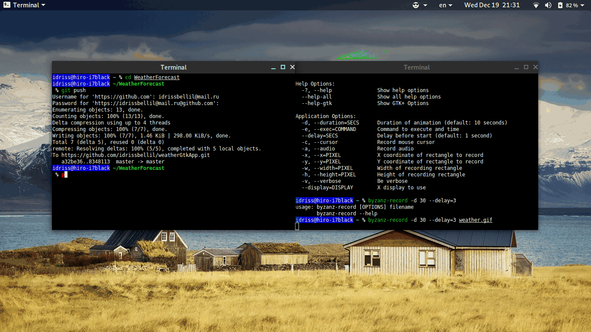

# Weather Gtk App

This app is a unfinished product for a another weather Gtk based application written in **Python 3** (because of pathlib), it was meant to be a technical challenge in order to have the right to interview for a position some time ago.

## Running the App

This App was tested under Python 3.7.1 and Gtk 3.24.1

```
git clone https://github.com/idrissbellil/weatherGtkApp.git
cd weatherGtkApp
python3 main.py
```

The user can start typing a city name and then browse the suggestions with up/down keys or a one mouse click, if the desired city doesn't show up and the user insists on using the entered name for query, the app will keep showing a suggestion of the same query he's entering.



## Main Components

The App itself is mainly a GtkSearchBar and a GtkSearchEntry interacting with the open weather map free account API.

### GtkSearchBar && GtkSearchEntry

The open weather map API provides an updated json file containing the list of cities in addition to few other information about the cities, we used this file containing more than 200k cities to provide suggestions on search query change (for a query equal or bigger than 3 characters).

Since we have to look up for potential matches every time the search query change, it should be ressource consuming and we designed a data structure inspired by [trie](https://en.wikipedia.org/wiki/Trie) to make looking for a suggestion nearly in constant complexity (using hash maps or python dictionaries), as a tree of Python dictionaries.

Little to no documentation was found on about how to put a GtkSearchBar && a GtkSearchEntry together except these two ressources [GtkSearchEntry](https://developer.gnome.org/gtk3/stable/GtkSearchEntry.html) && [GtkSearchBar](https://developer.gnome.org/gtk3/stable/GtkSearchBar.html) and [this](https://gitlab.gnome.org/GNOME/gtk/blob/gtk-3-24/examples/search-bar.c) example, they are all in **C programming language**.

Again two stackoverflow threads helped with the usage of the GtkImage component. The rest are all simple labels easy to interact with.

### The open weather map api

We encountered one major problem with this API: **Time zones**.

The json (default) output of this API provides no information about the timezone, while I am in China I provided a +8h manually in the script which is not an elegant way to solve this limitation. A more complete way should be to process the text given back by the API and compare it to the Unix UTC format time given. This and several other problems will solved given more time.
