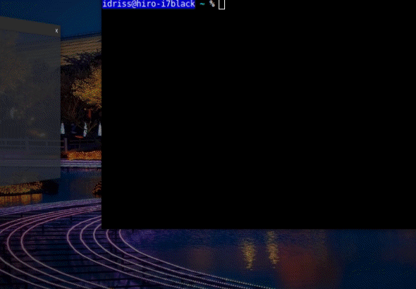

# Weather Gtk App

This app is a unfinished product for a another weather Gtk based application written in **Python**, it was meant to be a technical challenge in order to have the right to interview for a position some time ago (it was unsuccessful).

## Running the App

This App was tested under Python 3.7.1 and Gtk 3.24.1

```
git clone https://github.com/idrissbellil/weatherGtkApp.git
cd weatherGtkApp
python3 main.py
```

The user can start typing a city name and then browse the suggestions with up/down keys or a one mouse click, if the desired city doesn't show up and the user insists on using the entered name for query, the app will keep showing a suggestion of the same query he's entering.



## Main Components

The App itself is mainly a GtkSearchBar and a GtkSearchEntry interacting with the open weather map free account API.

### GtkSearchBar && GtkSearchEntry

The open weather map API provides an updated json file containing the list of cities in addition to few other information about the cities, we used this file containing more than 200k cities to provide suggestions on search query change (for a query equal or bigger than 3 characters).

Since we have to look up for potential matches every time the search query change, it should be ressource consuming and we designed a data structure inspired by [trie](https://en.wikipedia.org/wiki/Trie) to make looking for a suggestion nearly in constant complexity (using hash maps or python dictionaries), as a tree of Python dictionaries.

For GtkSearchBar && GtkSearchEntry usage the ressource [Gtk.listbox](https://python-gtk-3-tutorial.readthedocs.io/en/latest/layout.html#listbox) was useful in addition to these two ressources [GtkSearchEntry](https://developer.gnome.org/gtk3/stable/GtkSearchEntry.html) && [GtkSearchBar](https://developer.gnome.org/gtk3/stable/GtkSearchBar.html) and [this](https://gitlab.gnome.org/GNOME/gtk/blob/gtk-3-24/examples/search-bar.c) example, which is in **C**.

### The open weather map api

The Open Weather Map API was used, with a free subscription that provides a limited number of requests per day. The API provides the weather forcast for the next 3 days with a step of 3h. The API suggests to sync in every 3h which I exactly did in this application.

In addition to weather forecast it also provides icons with a direct link, which was convenient while using the API.

